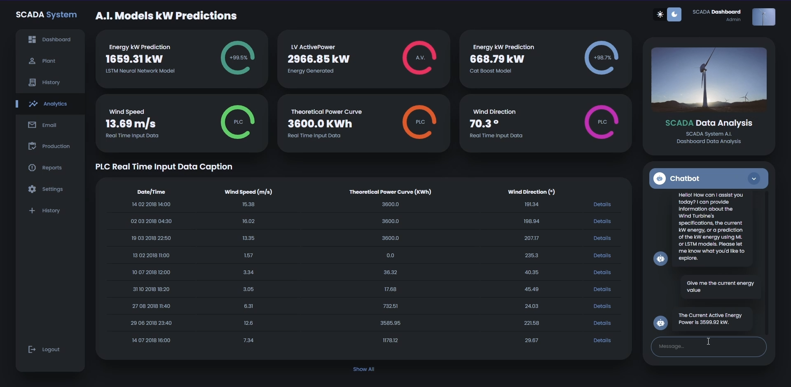
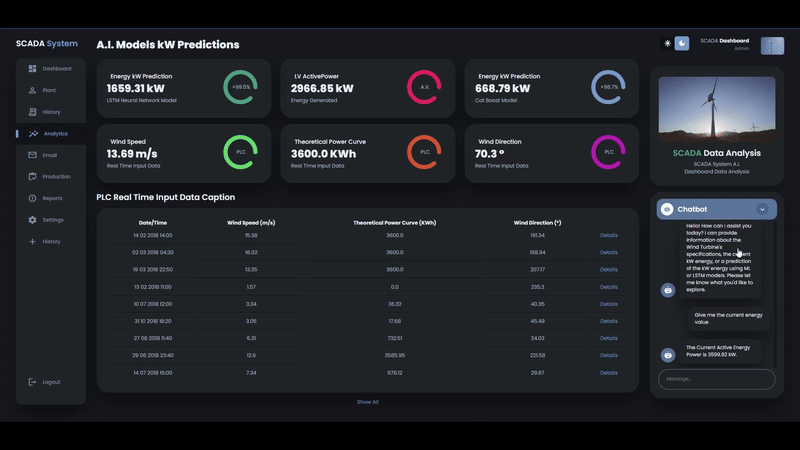
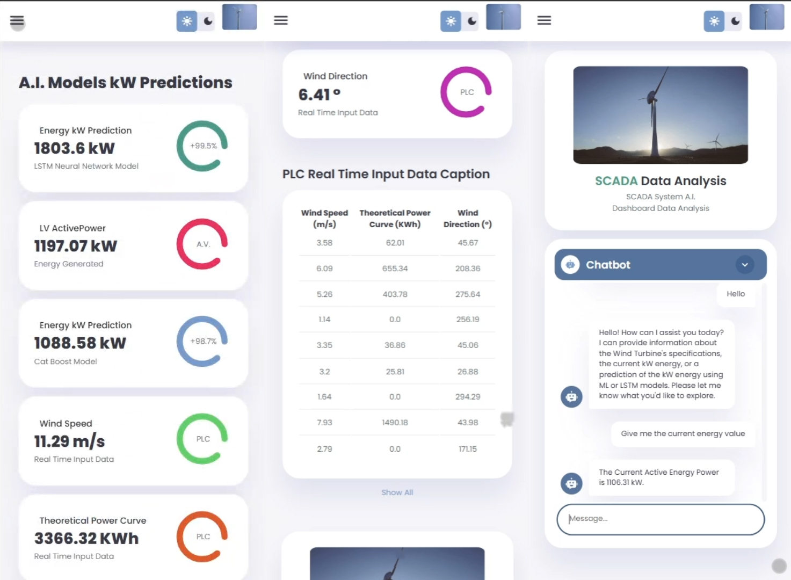

# SCADA Dashboard Simulation with Agent Chatbot and Machine Learning, LSTM Predictions Models

## SCADA Dashboard Simulation with Agent Chatbot and Machine Learning, LSTM Predictions Models, using Gemini-Flash 2.0, Flask, LangChain, TensorFlow and Scikit Learn

This is a project that uses Gemini-Flash 2.0 as LLM to create an Agent  Chatbot with LangChain. The Machine Learning and LSTM Model predicts the Energy Value of the Wind Turbines, recreating the Simulation of a SCADA Dashboard about Wind Turbines. The Agent has access to the AI Tools Models.

## Preview

- Dashboard Preview: https://youtu.be/v9rbItWB6hI?si=cz3KUaswAU0u8c0C

## Connect
- Linkedin: https://www.linkedin.com/in/luis-jose-mendez/
- GitHub: https://github.com/mendez-luisjose
